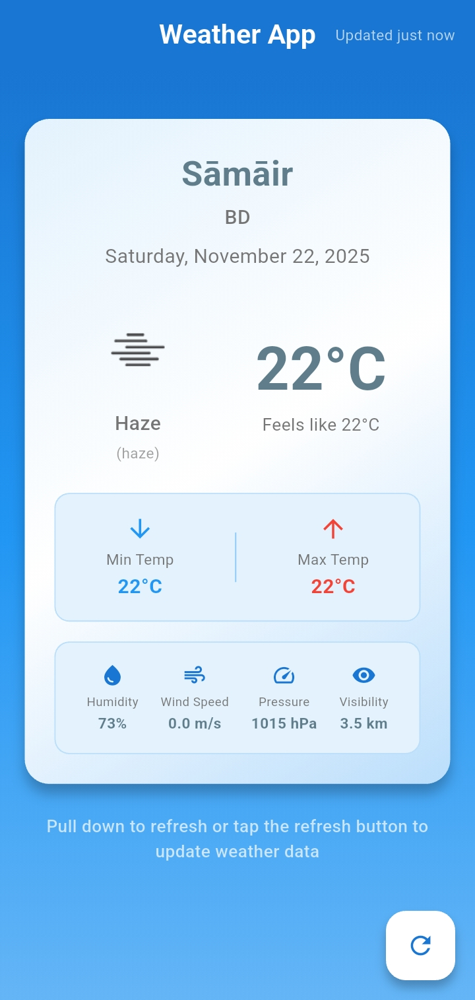

# Flutter Current Weather App

A simple Flutter application that displays the current weather information based on the user's location.

## Screenshot



## Folder Structure

The project follows a standard Flutter project structure, with the main application code located in the `lib` directory. The folder structure is organized as follows:

```
├── android
├── build
├── ios
├── lib
│   ├── src
│   │   ├── app.dart
│   │   ├── core
│   │   │   ├── constants
│   │   │   │   └── constants.dart
│   │   │   ├── errors
│   │   │   │   ├── exceptions.dart
│   │   │   │   └── failures.dart
│   │   │   ├── network
│   │   │   │   ├── dio_client.dart
│   │   │   │   └── end_points.dart
│   │   │   ├── utils
│   │   │   │   └── location_service.dart
│   │   │   └── widgets
│   │   ├── data
│   │   │   ├── datasources
│   │   │   │   └── weather_remote_data_source.dart
│   │   │   ├── models
│   │   │   │   └── weather_model.dart
│   │   │   └── repositories
│   │   │       └── weather_repository.dart
│   │   ├── domain
│   │   │   ├── entities
│   │   │   │   └── weather_entity.dart
│   │   │   ├── repositories
│   │   │   │   └── i_weather_repository.dart
│   │   │   └── usecases
│   │   │       └── get_current_weather.dart
│   │   └── presentation
│   │       ├── bindings
│   │       │   ├── app_binding.dart
│   │       │   └── home_binding.dart
│   │       ├── controllers
│   │       │   └── weather_controller.dart
│   │       ├── pages
│   │       │   └── home_page.dart
│   │       ├── route
│   │       │   ├── app_pages.dart
│   │       │   └── routes.dart
│   │       └── widgets
│   │           ├── error_widget.dart
│   │           ├── loading_widget.dart
│   │           └── weather_card.dart
│   └── main.dart
├── linux
├── macos
├── web
└── windows
```

- **`lib/`**: Contains the main Dart code for the application.
  - **`main.dart`**: The entry point of the application.
  - **`src/`**: Contains the source code of the application.
    - **`app.dart`**: The root widget of the application.
    - **`core/`**: Contains the core components of the application.
      - **`constants/`**: Application-wide constants.
      - **`errors/`**: Custom exception and failure classes.
      - **`network/`**: Network clients (Dio) and endpoints.
      - **`utils/`**: Utility classes like `LocationService`.
      - **`widgets/`**: Reusable core widgets.
    - **`data/`**: Contains the data layer.
      - **`datasources/`**: Remote data sources (API calls).
      - **`models/`**: Data models (e.g., `WeatherModel`).
      - **`repositories/`**: Repository implementations.
    - **`domain/`**: Contains the domain layer.
      - **`entities/`**: Business objects (e.g., `WeatherEntity`).
      - **`repositories/`**: Repository interfaces.
      - **`usecases/`**: Business logic use cases (e.g., `GetCurrentWeather`).
    - **`presentation/`**: Contains the presentation layer.
      - **`bindings/`**: Dependency injection bindings (GetX).
      - **`controllers/`**: State management controllers (GetX).
      - **`pages/`**: UI screens (e.g., `HomePage`).
      - **`route/`**: Application routing and navigation.
      - **`widgets/`**: UI components specific to the presentation layer.

## Getting Started

### Prerequisites

- Flutter SDK: `^3.10.1`
- Java Development Kit (JDK): Version 17 is recommended.

### Installation

1. Clone the repository:
   ```sh
   git clone https://github.com/your-username/flutter_current_weather.git
   ```
2. Navigate to the project directory:
   ```sh
   cd flutter_current_weather
   ```
3. Install the dependencies:
   ```sh
   flutter pub get
   ```
4. Run the application:
   ```sh
   flutter run
   ```